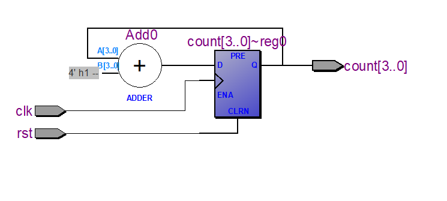

# 4-BIT-RIPPLE-COUNTER

## AIM:

To implement  4 Bit Ripple Counter using verilog and validating their functionality using their functional tables

## SOFTWARE REQUIRED:

Quartus prime

## THEORY

## 4 Bit Ripple Counter

A binary ripple counter consists of a series connection of complementing flip-flops (T or JK type), with the output of each flip-flop connected to the Clock Pulse input of the next higher-order flip-flop. The flip-flop holding the least significant bit receives the incoming count pulses. The diagram of a 4-bit binary ripple counter is shown in Fig. below.


In timing diagram Q0 is changing as soon as the negative edge of clock pulse is encountered, Q1 is changing when negative edge of Q0 is encountered(because Q0 is like clock pulse for second flip flop) and so on.


## Procedure
1.Code Overview: Understand the Verilog module ripple_counter, which includes clock (clk) and reset (rst) inputs, and a 4-bit output count. The counter increments on each positive clock edge unless reset is asserted, resetting the count to 0.

2.Simulation Preparation: Use a Verilog simulator (e.g., ModelSim) and write a testbench module to apply clock and reset signals while monitoring the counter output.

3.Testbench Implementation: Instantiate the ripple_counter module in the testbench, generate clock and reset signals, apply them to the counter module, and observe the count output.

4.Simulation Execution: Compile both the counter module and the testbench, simulate the design, and verify that the counter counts from 0 to 15 (binary 1111) and resets to 0 when the reset signal is activated.

5.Verification and Debugging: Analyze timing diagrams to ensure proper counter behavior, debug any encountered issues during simulation, and make necessary modifications to the design for optimal functionality
## PROGRAM
#### NAME : Sriram R
#### REGISTER NUMBER:212223230215
```
module ripple_counter(
     input wire clk,
	  input wire rst,
	  output reg[3:0] count
	  );
	  
always @(posedge clk or posedge rst)
begin
     if(rst)
	     count <= 4'b0000;
	  else 
	     count <= count + 1;
end 
endmodule 
```

### RTL LOGIC FOR 4 Bit Ripple Counter

## TIMING DIGRAMS FOR 4 Bit Ripple Counter

## RESULTS
Thus 4-bit-ripple-counter has been executed successfully